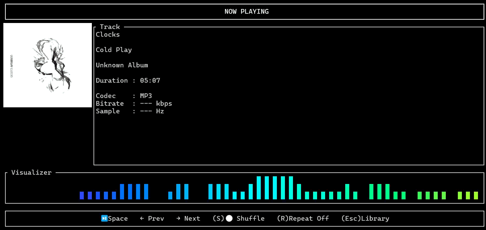

<div align="center">


# 🎵 JAM

### A fast, modern terminal music player written in Rust.



*Built as a learning project to explore Rust while creating a full-featured CLI music player.*

**🚧 Work In Progress**

---


</div>

---

## About

JAM is a terminal music player built entirely in **Rust**.

The goal is to create something that feels as polished as modern GUI music players while staying completely inside the terminal.

This is also my **first Rust project**, so I'm treating it as an opportunity to learn Rust by building a real application instead of small tutorials.

The long-term vision is a music player that supports:

- 🎵 Local music libraries
- 📺 YouTube music
- ⚡ Extremely fast search
- 🎨 Beautiful TUI
- 📀 Album artwork
- 📈 Real-time visualizers
- 📂 Playlists
- 🎧 Queue management
- 🔌 Plugin support

---

# Current Status

## ✅ Local Music

The local music player is currently the most complete part of the project.

It supports scanning a music library, searching tracks, album artwork, playback controls, queues, shuffle, repeat, autoplay and a real-time visualizer.

## 🚧 YouTube

The YouTube integration is currently under active development.

Searching works, but playback is still being reworked to use a download-and-cache pipeline instead of direct streaming.

---

# Features

## 🎵 Local Music Library

- Scan an entire music folder
- Automatic library detection
- Metadata extraction
- Album artwork
- Artist & album information
- Fast startup
- Instant playback

---

## 🔍 Search

### Local Library

- Live filtering
- Fuzzy search
- Song search
- Artist search
- Album search

---

## ▶ Playback

- Play songs
- Pause
- Resume
- Stop
- Previous track
- Next track
- Automatic next song
- Queue support
- Shuffle
- Repeat One
- Repeat All
- Repeat Off

---

## 🎨 Terminal UI

- Built with Ratatui
- Keyboard-first workflow
- Responsive layouts
- Dedicated screens
- Album artwork rendering
- Real-time spectrum visualizer

---

## 📺 YouTube (WIP)

Current progress:

- Search YouTube
- Browse results
- Select songs

In Progress:

- Download selected songs
- Playback
- Caching
- Queue integration
- Autoplay
- Recommendations

---


# Keyboard Shortcuts

## Navigation

| Key | Action |
|------|--------|
| ↑ ↓ | Navigate |
| Enter | Select |
| Esc | Back |
| q | Quit |

---

## Library

| Key | Action |
|------|--------|
| / | Search |
| Enter | Play selected song |

---

## Now Playing

| Key | Action |
|------|--------|
| Space | Pause / Resume |
| n | Next |
| b | Previous |
| s | Shuffle |
| r | Repeat |

---

# Installation

## Requirements

- Rust
- Cargo
- yt-dlp
- FFmpeg
- Node.js (recommended for YouTube support)

Clone the repository

```bash
git clone https://github.com/DrsikaGupta/jam.git

cd jam
```

Run

```bash
cargo run
```

---

# Project Structure

```
src/
│
├── audio/
├── app/
├── cache/
├── config/
├── keybindings/
├── library/
├── plugin/
├── search/
├── theme/
├── tui/
└── youtube/
```

---

# Roadmap

## Core

- [x] Local music playback
- [x] Metadata extraction
- [x] Album artwork
- [x] Playback controls
- [x] Queue
- [x] Shuffle
- [x] Repeat
- [x] Autoplay
- [x] Audio visualizer

---

## YouTube

- [x] Search
- [ ] Download selected song
- [ ] Playback
- [ ] Queue support
- [ ] Autoplay
- [ ] Background downloads
- [ ] Smart caching

---

## Library

- [ ] Playlist support
- [ ] Smart playlists
- [ ] Recently played
- [ ] Favorites
- [ ] Most played

---

## Audio

- [ ] Gapless playback
- [ ] Crossfade
- [ ] Equalizer
- [ ] ReplayGain
- [ ] Volume normalization

---

## UI

- [ ] Redesigned Now Playing screen
- [ ] Lyrics
- [ ] Themes
- [ ] Mouse support
- [ ] Notifications
- [ ] Better artwork rendering

---

## Future Ideas

- Spotify Connect-style remote control
- Last.fm scrobbling
- Discord Rich Presence
- MPRIS support (Linux)
- Plugin system
- Music recommendations
- Streaming radio
- Podcast support

---

# Why Rust?

I had never written Rust before starting JAM.

Instead of learning the language through small exercises, I wanted to build a real project that would expose me to:

- ownership & borrowing
- async programming
- concurrency
- terminal UI development
- audio processing
- filesystem APIs
- external processes
- project architecture

JAM is both a music player and my journey learning Rust.

---

# Built With

- Rust
- Ratatui
- Crossterm
- Rodio
- Symphonia
- Lofty
- RustFFT
- yt-dlp
- Image

# License

MIT License

---

<div align="center">

### ⭐ If you like the project, consider giving it a star!

</div>
